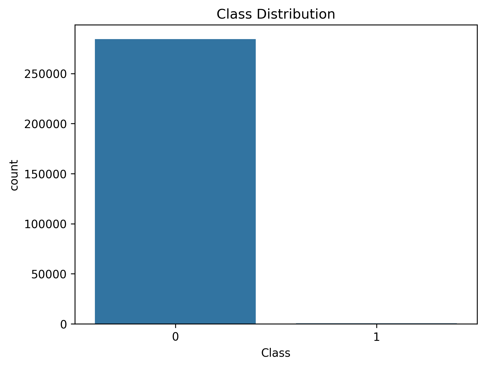
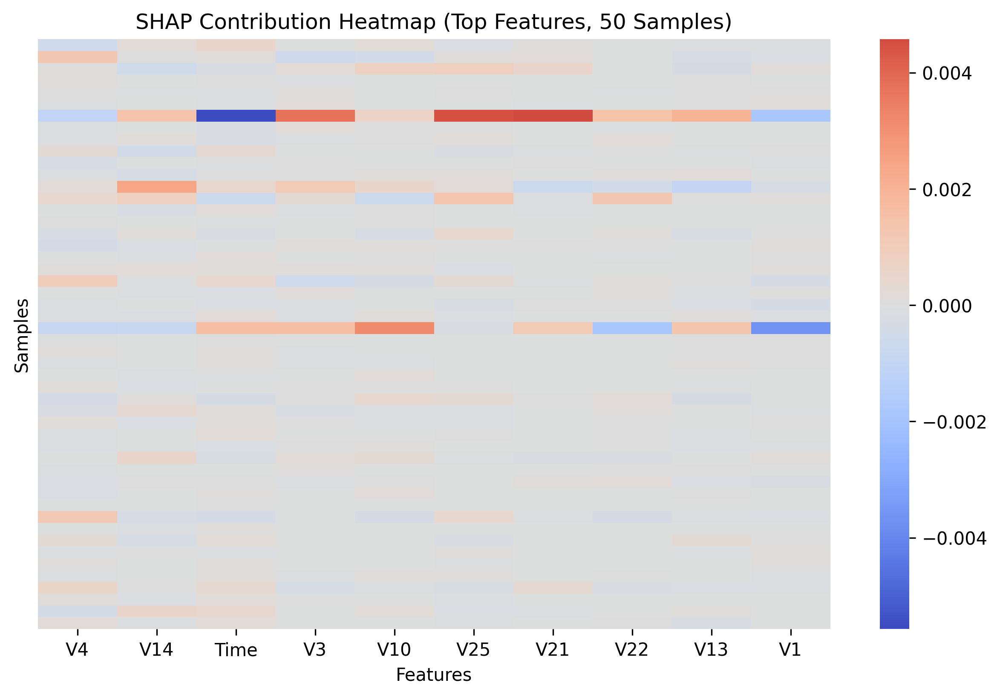
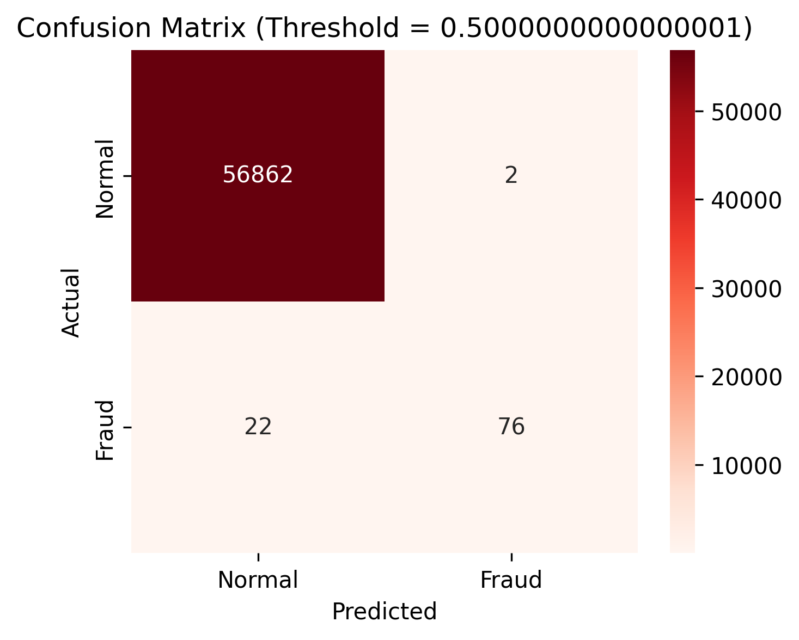
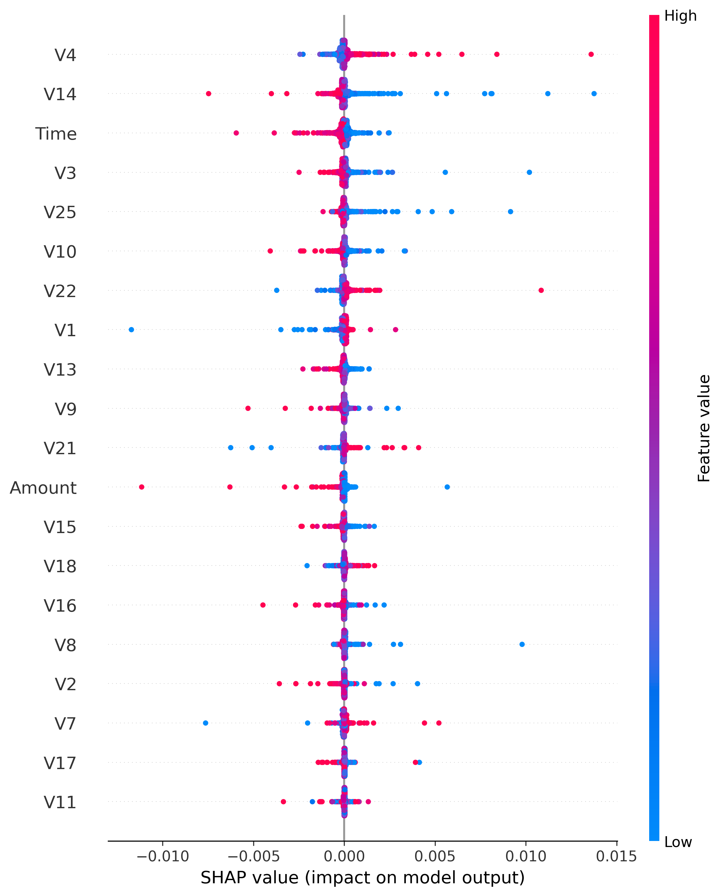
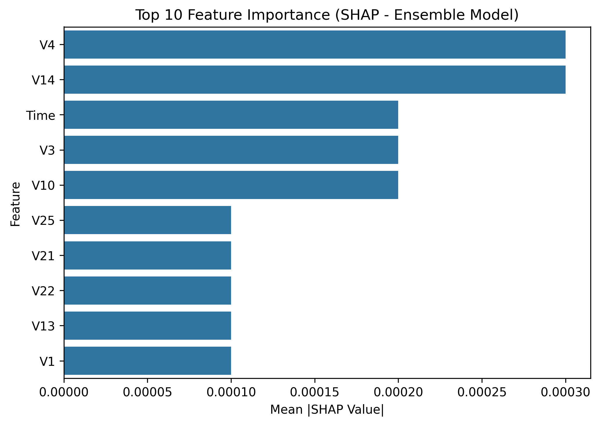
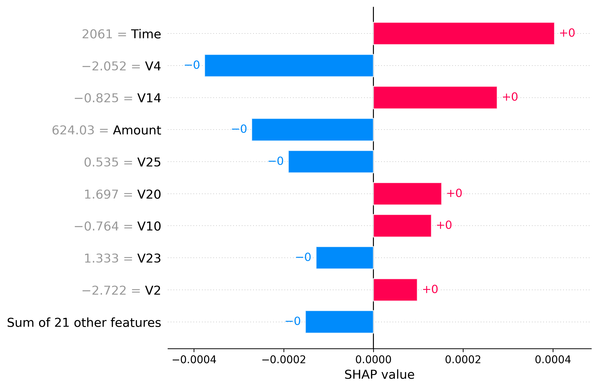

# Credit Card Fraud Detection using Ensemble Learning and Explainable AI

A machine learning-based fraud detection system designed to identify fraudulent credit card transactions in highly imbalanced datasets. The project combines data balancing techniques, ensemble learning, probability calibration, and SHAP explainability to improve fraud detection performance and model transparency.

---

## Project Overview

Credit card fraud detection is a highly imbalanced classification problem where fraudulent transactions represent only a small fraction of all transactions. This project develops a machine learning pipeline that combines ensemble learning, probability calibration, threshold optimization, and explainable AI to improve fraud detection performance.

The workflow focuses on maximizing fraud detection while minimizing false positives through careful model evaluation and threshold selection.

---

## Dataset

The project uses the **Credit Card Fraud Detection Dataset** from Kaggle.

### Dataset Statistics

* Total Transactions: 284,807
* Fraudulent Transactions: 492
* Legitimate Transactions: 284,315
* Severe class imbalance (~0.17% fraud)

Dataset Link:

https://www.kaggle.com/datasets/mlg-ulb/creditcardfraud

> The dataset is not included in this repository. Download `creditcard.csv` from Kaggle before running the notebook.

---

## Machine Learning Pipeline
### 1. Data Exploration
* Class distribution analysis
* Correlation analysis
* Feature exploration
### 2. Data Preprocessing
* Data cleaning
* Feature scaling
* Train-test split
### 3. Model Training

#### The following models were trained and evaluated:

* Logistic Regression
* Random Forest
* XGBoost
* Ensemble Model
### 4. Ensemble Learning

A Soft Voting Ensemble was built using:

* Logistic Regression
* Random Forest
* XGBoost
### 5. Probability Calibration

Predicted probabilities were calibrated to improve confidence estimation and decision reliability.

### 6. Threshold Optimization

Instead of relying on the default classification threshold of 0.5, threshold optimization was performed to improve fraud detection performance and balance precision-recall trade-offs.

### 7. Explainable AI

SHAP (SHapley Additive Explanations) was used to interpret model predictions and identify the features that contributed most to fraud detection decisions.
---

## Technologies Used

* Python
* Pandas
* NumPy
* Scikit-Learn
* XGBoost
* Imbalanced-Learn (SMOTE)
* SHAP
* Matplotlib
* Seaborn
* Kaggle Notebooks

---

## Repository Structure

```text
CREDIT-CARD-FRAUD-DETECTION/
│
├── images/
│   ├── Class_distribution.png
│   ├── Confusion_matrix.png
│   ├── global_feature_importance.png
│   ├── Heatmap.png
│   ├── PR-AUC Curve.png
│   ├── shap_local_bar.png
│   └── shap_topbar.png
│
├── notebooks/
│   └── fair-fraud-detection-system.ipynb
│
├── .gitignore
├── LICENSE
├── README.md
└── requirements.txt
```

---

## Results

### Final Ensemble Model Performance

| Metric    | Score  |
| -------   | ------ |
| ROC-AUC   | 0.9557 |
| PR-AUC    | 0.8629 |
| Precision | 0.97   |
| Recall    | 0.78   |
| F1-Score  | 0.86   |

The ensemble model achieved strong performance in identifying fraudulent transactions while maintaining a low false-positive rate.

---

## Visualizations

### Class Distribution



### Correlation Heatmap



### Confusion Matrix



### Precision-Recall Curve


### Global Feature Importance



### SHAP Global Explanation



### SHAP Local Explanation



---

## Key Features

* Ensemble Learning (Logistic Regression, Random Forest, XGBoost)
* Soft Voting Classifier
* Probability Calibration
* Threshold Optimization
* SHAP Explainability
* Precision-Recall Analysis
* Fraud Detection on Highly Imbalanced Data
* Feature Importance Visualization
---

## Installation

Clone the repository:

```bash
git clone https://github.com/StaRi-ya-se/Credit-Card-Fraud-Detection.git
cd Credit-Card-Fraud-Detection
```

Install dependencies:

```bash
pip install -r requirements.txt
```

Run the notebook:

```bash
jupyter notebook notebooks/fair-fraud-detection-system.ipynb
```

---

## Future Improvements

* Hyperparameter tuning using Optuna
* Real-time fraud detection API
* Deep learning-based fraud detection models
* Model deployment with FastAPI and Docker
* Automated model monitoring and retraining

---

## Author

**Riya Gupta**

B.Tech Computer Science (IoT & Intelligent Systems)
Manipal University Jaipur

GitHub: https://github.com/StaRi-ya-se

---

## License

This project is licensed under the MIT License.
